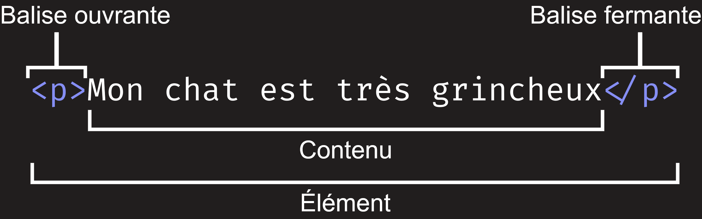
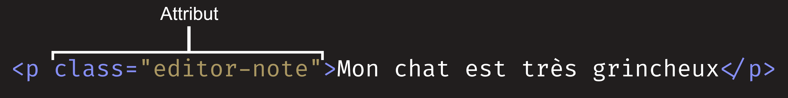

# HTML

## 📖 Introduction à HTML

**HTML** signifie *HyperText Markup Language*. C’est un **langage de balisage** qui permet de créer le **contenu et la structure** des pages web.  

💡 Il est souvent utilisé **avec CSS** (mise en forme) et **JavaScript** (interaction).

```html
.html    => extension des fichiers HTML
<!-- ceci est un commentaire -->
```

---

## Syntaxe de base
HTML fonctionne avec des balises (ou "éléments") :
```html
<p>Mon chat est noir et blanc</p>
```
Explication :

- `<p>` : balise ouvrante

- `</p>` : balise fermante

- `Mon chat est noir et blanc` : contenu

- Élément HTML = balise ouvrante + contenu + balise fermante



## ⚠️ Attention à la bonne imbrication :
```html
<!-- ✅ Correct -->
<p>Mon chat est <strong>très</strong> grincheux.</p>

<!-- ❌ Incorrect -->
<p>Mon chat est <strong>très grincheux.</p></strong>
```

---

## Attributs HTML

Un élément HTML peut contenir des attributs :
```html
<p class="editor-note">Texte important</p>
```
- `class` : nom de l'attribut
- `editor-note` : valeur de l'attribut



---

## Éléments vides

Certains éléments n'ont pas de contenu, comme `` :

```html

```
- `src` : chemin de l’image

- `alt` : description alternative (accessibilité)

---

## Structure d’une page HTML

```html
<!doctype html>
<html lang="fr">
  <head>
    <meta charset="utf-8" />
    <meta name="viewport" content="width=device-width" />
    <title>Ma page de test</title>
  </head>
  <body>
    
  </body>
</html>
```

### Détails :

- `<!doctype html>` : obligatoire, indique le type de document

- `<html>` : élément racine

- `<head>` : métadonnées (titre, encodage, liens CSS, etc.)

- `<meta charset="utf-8">` : encodage universel

- `<meta name="viewport">` : responsive pour mobiles

- `<title>` : titre de la page

- `<body>` : contenu visible

---

## Images
```html

```
- `src` : chemin de l’image

- `alt` : texte alternatif (accessibilité ou erreur de chargement)

---

## Mise en forme du texte
### Titres
```html
<h1>Titre principal</h1>
<h2>Titre secondaire</h2>
<h3>Sous-titre</h3>
<h4>Sous-sous-titre</h4>
```

### Paragraphes
```html
<p>Ceci est un paragraphe</p>
```

### Gras et italique
```html
<strong>Texte en gras</strong>
<em>Texte en italique</em>
```

---

## Listes
### Liste non ordonnée (ul)
Liste non ordonnée (ul) : utilisée quand l’ordre des éléments n’a pas d’importance, par exemple une liste d’ingrédients.
```html
<ul>
  <li>Item 1</li>
  <li>Item 2</li>
</ul>
```

### Liste ordonnée (ol)
Liste ordonnée (ol) : utilisée quand l’ordre des éléments est important, comme une série d’étapes à suivre.
```html
<ol>
  <li>Étape 1</li>
  <li>Étape 2</li>
</ol>
```

---

## Liens
```html
<a href="https://github.com/AlexerV">Manifeste Mozilla</a>
```
- `href` : destination du lien

- ⚠️ Pense à toujours inclure `http://` ou `https://` pour éviter les erreurs

---

## Formulaires HTML
Les formulaires permettent de collecter des données saisies par les utilisateurs (ex : nom, email, mot de passe, etc.).

```html
<form action="/traitement" method="post">
  <label for="nom">Nom :</label>
  <input type="text" id="nom" name="nom" required>

  <label for="email">Email :</label>
  <input type="email" id="email" name="email">

  <label for="mdp">Mot de passe :</label>
  <input type="password" id="mdp" name="motdepasse">

  <input type="submit" value="Envoyer">
</form>
```

### Principaux éléments de formulaire :

- `<form>` : conteneur du formulaire

- `<input>` : champ de saisie

- `<label>` : texte associé à un champ

- `<textarea>` : zone de texte multiligne

- `<select>` et <option> : liste déroulante

- `<button>` : bouton

Exemple avec plus de champs :

```html
<form>
  <p>Votre pays :</p>
  <select name="pays">
    <option value="fr">France</option>
    <option value="ca">Canada</option>
  </select>

  <p>Votre genre :</p>
  <input type="radio" name="genre" value="homme" checked> Homme
  <input type="radio" name="genre" value="femme"> Femme

  <p>Langues parlées :</p>
  <input type="checkbox" name="langue1" value="fr"> Français
  <input type="checkbox" name="langue2" value="en"> Anglais
</form>
```

---

## Les tableaux en HTML
Les tableaux permettent d’organiser les données en lignes et colonnes.

```html
<table border="1">
  <thead>
    <tr>
      <th>Nom</th>
      <th>Âge</th>
      <th>Pays</th>
    </tr>
  </thead>
  <tbody>
    <tr>
      <td>Alexer</td>
      <td>19</td>
      <td>France</td>
    </tr>
    <tr>
      <td>Marie</td>
      <td>22</td>
      <td>Canada</td>
    </tr>
  </tbody>
</table>
```
### Éléments principaux :

- `<table>` : balise du tableau

- `<thead>` : entête du tableau

- `<tbody>` : corps du tableau

- `<tr>` : ligne

- `<th>` : cellule d'entête

- `<td>` : cellule normale

## Fusion de cellules :
```html
<td colspan="2">Fusionner 2 colonnes</td>
<td rowspan="3">Fusionner 3 lignes</td>
```

---

## Attributs avancés des éléments HTML
### L’attribut title
L’attribut `title` permet d’ajouter une info-bulle qui s’affiche au passage de la souris sur un élément.
```html
<p title="Ceci est un paragraphe">Survolez-moi !</p>
```

### L’attribut target dans les liens
L’attribut `target` indique où ouvrir le lien.

- `_self` : ouvrir dans la même fenêtre (par défaut)

- `_blank` : ouvrir dans un nouvel onglet ou une nouvelle fenêtre

- `_parent` et `_top` sont plus spécifiques pour les frames.

Exemple pour ouvrir un lien dans un nouvel onglet :
```html
<a href="https://example.com" target="_blank">Visitez Example.com</a>
```

### L’attribut rel
Quand tu utilises `target="_blank"`, il est recommandé d’ajouter `rel="noopener noreferrer"` pour des raisons de sécurité.
```html
<a href="https://example.com" target="_blank" rel="noopener noreferrer">Lien sécurisé</a>
```

---

## Médias intégrés : audio et vidéo
### L’élément `<audio>`
Permet d’insérer un fichier audio dans une page web.
```html
<audio controls>
  <source src="musique.mp3" type="audio/mpeg" />
  <source src="musique.ogg" type="audio/ogg" />
  Votre navigateur ne supporte pas la balise audio.
</audio>
```

### L’élément `<video>`
Permet d’insérer une vidéo.
```html
<video width="320" height="240" controls>
  <source src="video.mp4" type="video/mp4" />
  <source src="video.webm" type="video/webm" />
  Votre navigateur ne supporte pas la balise vidéo.
</video>
```

Attributs utiles :

- `controls` : affiche les contrôles (play, pause…)

- `autoplay` : lance automatiquement la lecture

- `loop` : rejoue la vidéo en boucle

- `muted` : désactive le son

---

## Les entités HTML (caractères spéciaux)
Certains caractères ont une signification particulière en HTML et doivent être encodés sous forme d’entités.

Exemples :
- `&lt;` affiche `<`

- `&gt;` affiche `>`

- `&amp;` affiche `&`

- `&nbsp;` espace insécable

- `&copy;` ©

- `&eacute;` é

Exemple dans une page :
```html
<p>5 &lt; 10 signifie que 5 est inférieur à 10.</p>
```

---

## Accessibilité web (a11y)
L’accessibilité permet aux personnes en situation de handicap d’utiliser le web.

### Attributs ARIA
ARIA (Accessible Rich Internet Applications) permet de donner plus d’informations aux technologies d’assistance.

Exemple :
```html
<button aria-label="Fermer la fenêtre">X</button>
```
Ici, même si le bouton n’a qu’un "X", un lecteur d’écran dira « Fermer la fenêtre ».

## Bonnes pratiques

- Toujours utiliser des balises sémantiques (ex: `<nav>`, `<main>`, `<header>`, etc.)

- Fournir un texte alternatif (`alt`) pertinent pour les images

- Utiliser les légendes avec les médias (ex: `<track>` pour sous-titres dans `<video>`)

---

## Métadonnées et SEO
### Balises `<meta>` utiles dans `<head>`
- Description de la page :
```html
<meta name="description" content="Page d'exemple pour apprendre le HTML" />
```
- Mots-clés (moins utilisé aujourd’hui) :
```html
<meta name="keywords" content="HTML, cours, tutoriel, programmation" />
```
- Auteur de la page :
```html
<meta name="author" content="Alexer" />
```

### Open Graph pour réseaux sociaux
Permet d’améliorer l’affichage des liens partagés sur Facebook, Twitter, etc.
```html
<meta property="og:title" content="Mon super site" />
<meta property="og:description" content="Apprenez à créer des pages web." />
<meta property="og:image" content="https://exemple.com/image.jpg" />
<meta property="og:url" content="https://exemple.com" />
```

---

## Autres éléments HTML utiles
### Iframe (inclusion de contenu externe)
```html
<iframe src="https://example.com" width="600" height="400"></iframe>
```

### Balises sémantiques (pour structurer le contenu)

- `<header>` : en-tête de page

- `<footer>` : pied de page

- `<nav>` : barre de navigation

- `<article>` : contenu autonome

- `<section>` : section de contenu

- `<aside>` : contenu secondaire (ex : barre latérale)

---

### Attributs globaux (utilisables partout)

- `id` : identifiant unique

- `class` : classe CSS

- `style` : style en ligne

- `title` : info-bulle

- `hidden` : cacher un élément

- `lang` : définir la langue d’un élément

---

## Validateur HTML

Il est important de vérifier la validité de son code HTML pour éviter les erreurs et garantir la compatibilité.

Tu peux utiliser le validateur officiel du W3C ici : https://validator.w3.org/

Tu peux coller ton code HTML ou fournir une URL, et il te donnera un rapport avec les erreurs et suggestions d’amélioration.
