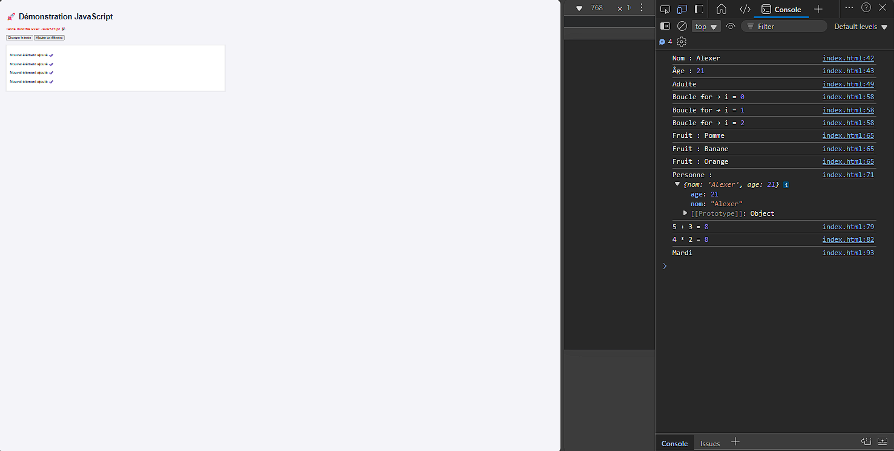

1. Ouvre ce fichier avec ton navigateur (`double-clic` ou `clic droit` → *Ouvrir avec navigateur*).

2. Tu verras :
  - Un texte qui peut être modifié par un bouton.
  - Un bouton qui ajoute dynamiquement de nouveaux éléments.
  - Et toutes les sorties dans **la console** (`F12` → onglet *Console*).

Tu devrais avoir une sortie comme la capture en dessous :

