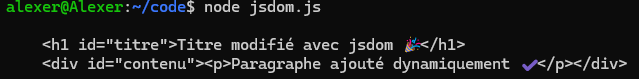

Programme Node.js avec jsdom

- Installer jsdom (une seule fois dans ton projet) :
```bash
npm install jsdom
```

- Lancer le programme :
```bash
node dom-node.js
```

- Résultat → le HTML modifié sera affiché directement dans ton terminal.


