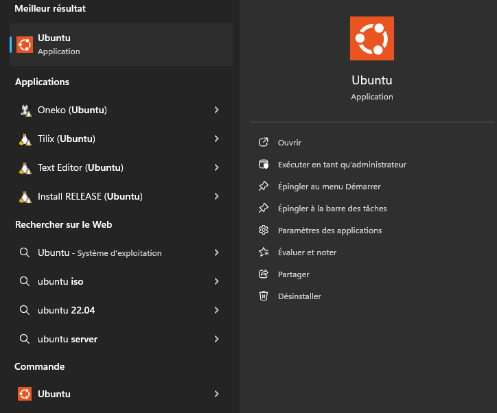

# 🐧 Installer une distribution Linux sur Windows avec WSL

> ⚠️ Ce guide permet d’installer **uniquement un terminal Linux** (ligne de commande) sous Windows.  
> Il **n'inclut pas d'interface graphique** (comme GNOME, KDE, etc.).

---

## 🔧 Étapes d'installation

### 1. Ouvrir l'invite de commande Windows

- Appuyez sur `Win + R`, tapez `cmd`, puis validez.

### 2. Installer WSL

Dans le terminal, entrez la commande suivante :

```bash
wsl --install
```

Cela installe WSL et la configuration par défaut.

### 3. Lister les distributions disponibles

Pour afficher les distributions Linux disponibles à l’installation :

```bash
wsl --list --online
```

### 4. Installer une distribution spécifique

Remplacez `[distribution]` par le nom de la distribution souhaitée :

```bash
wsl --install -d [distribution]
```

Exemple avec Ubuntu :

```bash
wsl --install -d Ubuntu
```

### 5. Redémarrer l'ordinateur

Une fois l'installation terminée, redémarrez votre machine.

### 6. Lancer la distribution Linux

Après redémarrage :

- Ouvrez le menu Démarrer


- Recherchez le nom de la distribution installée (ex : Ubuntu)

- Cliquez dessus pour lancer votre terminal Linux




### Et après ?

Pour commencer à utiliser Linux efficacement, consultez la section (lien vers les commandes)
